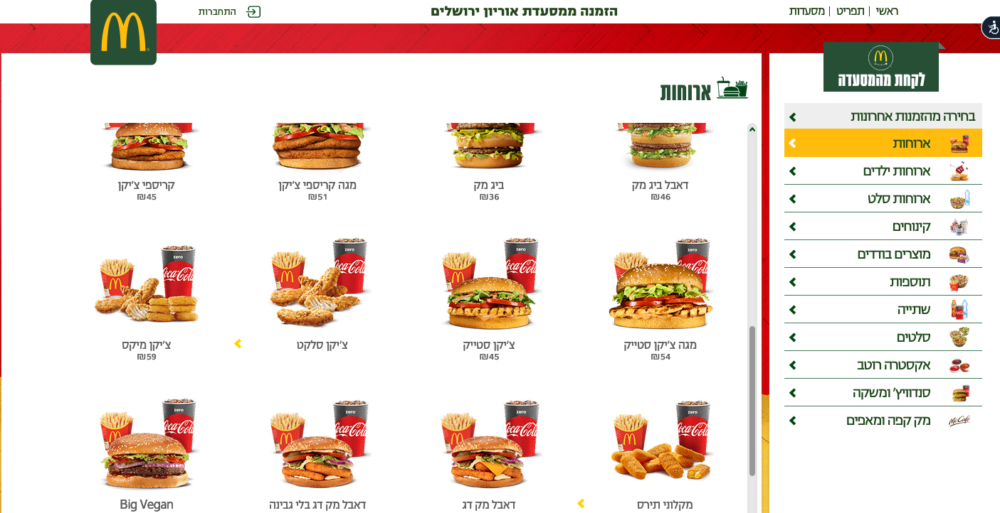
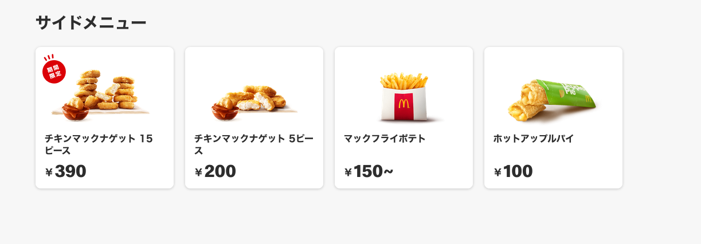
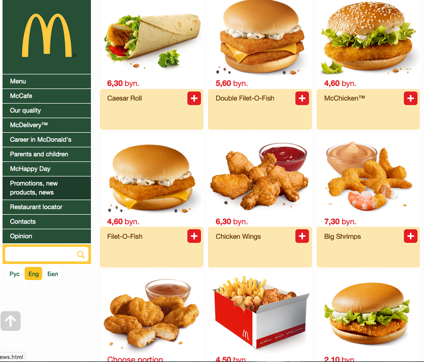

# The Nuggulator

Planning a walk? Don't starve! 

Use the Nuggulator to help you!

The Nuggulator tells you how many McNuggets you need to walk a certain distance. Then it breaks that nugget count down into the denominations available at a McDonald's near you.

Try it out [here.](seinwave.github.io/nuggulator)

I don't like to exaggerate — but I think it may be a million times more important than Facebook and Wikipedia put together.

## Rationale

### Okay. Um. Why does this exist?

I was reading about [the Frobenius problem](https://en.wikipedia.org/wiki/Coin_problem)(for some reason). 

The Frobenius number refers to the largest monetary amount that cannot be obtained using a specific set of coin denominations. It's an [NP-complete problem.](https://en.wikipedia.org/wiki/NP-completeness)

And in that Wiki, I saw that McNuggets could be another instance of Frobenius fun. 

That was the germ that started the idea. 

Oblique and kind of dumb, I know. 

## Execution

### What's your tech stack?

Nothing too complicated. Hardly a stack to speak of, really.

`React` front-end, with a `JSON` of my McNugget data built in. 

Results get shunted to the `Google Maps` `Places API`, and it sends an appropriate response back.

About as simple as could be.

## Where'd you get your Nugget data?

This was, by far, the most time-consuming part of the development process.

The sun never sets on McDonalds' empire. You can find McNuggets in 108 countries. I didn't want to leave out a single one.

And while some countries share nugget denomination sets ([4,9,20] or [6,10,15], etc) in common, they didn't present this information in any common format.

Sometimes it looked like this.

Or like this.

Or even like this.

<figure>

(Perhaps I can interest you in some Big Shrimps?)

Which meant that writing a scraping script — my preferred method of getting this kind of data — would not be possible.

I had to do it all by hand, visiting McDonalds.kz or McDonalds.fr or McDonalds.jp, and writing down what I saw.

In one instance (the American Virgin Islands), I even had to pick up the phone.

But as you can see, the results were *clearly* worth it.

## How are calories calculated?

So glad you asked. 

It starts with the [compendium of physical activities](https://sites.google.com/site/compendiumofphysicalactivities/home), which estimates the amount of exertion required to perform a given activity.

The compendium uses a unit of energy called the MET (metabolic equivalents . 1 MET is the amount of energy it takes to sit quietly. 3.5 METs is about what it takes for the average person to walk.

Once I found that out, I was able to plug that value in to metabolic calculators that account for age, height, weight, and gender. 

Mostly derived from the [Harris-Benedict forumla.](https://sites.google.com/site/compendiumofphysicalactivities/corrected-mets)

## I'm from [COUNTRY] and you got my denominations wrong!

Of course I did! I'm so sorry!

Please, feel free to email me about this. I want the Nuggulator to be as accurate as possible.

## Clone this app!

If you have ideas to improve the Nuggulator, by all means, fork the repo.

If you want to clone it on your local machine, you should have a pretty easy time of it. Just clone the master branch, using whichever protocl you prefer. 

The only dependency you'll need is `tachyons`, to preserve the stylings. `npm install tachyons` will get you there.

If, however, you just want to play with the data — I've got you covered. Here's my McNugget Denomination Dataset:

- As a <a href = "https://github.com/seinwave/nuggulator/blob/23fe305a94734297a4c3afbef7293bd23d2b3bc3/src/components/engines/countries.json">JSON.</a>
- As a <a href = "https://github.com/seinwave/nuggulator/blob/d2ea9a55ea3fa721e466d32a5176d8a1f1f8567b/src/components/engines/countries.csv">CSV.</a>

All I ask is you credit me, should you decide to use it.

Enjoy!
